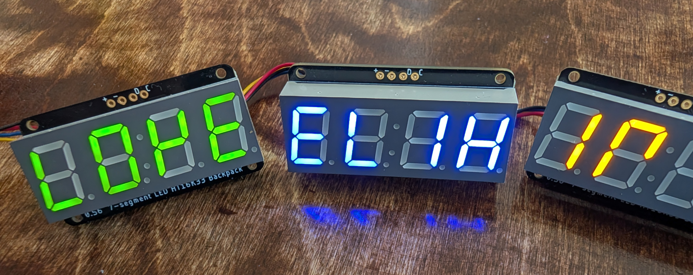

# Ht16k33Multi

[](https://github.com/alexisruccius/ht16k33_multi/actions/workflows/CI.yml)

`Ht16k33Multi` is a library for controlling one or more `Ht16k33` microchips,
which are commonly used to drive 7-segment displays, such as these shown below:



The docs can be found at <https://hexdocs.pm/ht16k33_multi>.

## Features

The main features of `Ht16k33Multi` include:

- Displaying numbers on a 7-segment display
- Displaying words using a special 7-segment font
- Supporting multiple displays (hence the "multi" in the library name).
  You can easily chain multiple `Ht16k33` devices to display full sentences or other content across them.
- Utilizing the built-in blinking and dimming features of the `Ht16k33` microchip


## Usage

A typical setup involves using the `Ht16k33` with a 7-segment display and a Raspberry Pi — such as the Raspberry Pi Zero.

You can use the [Nerves Project](https://hexdocs.pm/nerves/getting-started.html)
to build firmware for the Raspberry Pi and other embedded systems like the BeagleBone.
See the [list of supported targets](https://hexdocs.pm/nerves/supported-targets.html) (Nerves Project) for more information.

## Installation

1. **Connect the `Ht16k33` to your embedded system**.
  See the [Connect the device to the I²C bus and power](#connect-the-device-to-the-i2c-bus-and-power) section for details.

2. **Add the library to your dependencies**

    ```elixir
    # mix.exs
    defp deps do
      [
        {:ht16k33_multi, "~> 0.2"}
      ]
    end
    ```

3. **Fetch the dependencies**

    ```shell
    mix deps.get
    ```

4. **Start the `Ht16k33Multi` GenServer**

    You can start it manually in `iex`:

    ```elixir
    iex> Ht16k33Multi.start_link()
    ```

    Or supervise it within your application:

    ```elixir
    children = [
      # Single device with default I²C bus ("i2c-1") and address (0x70)
      Ht16k33Multi,

      # OR with explicit options
      {Ht16k33Multi, i2c_bus: "i2c-1", address: 0x70}
    ]
    ```

    If you're using multiple devices (all on the default I²C bus `"i2c-1"`), assign each a name and address:

    ```elixir
    children = [
      {Ht16k33Multi, name: :red_leds, address: 0x70},
      {Ht16k33Multi, name: :blue_leds, address: 0x71},
      {Ht16k33Multi, name: :yellow_leds, address: 0x72}
    ]
    ```


      > #### Detect I2C Bus and Device Address {: .tip}
      > See the [Device Address](#device-address) section to learn how to detect your I²C bus and device address.

5. **Write to the display**

    Display a message:

    ```elixir
    iex> Ht16k33Multi.write("Hola")
    ```

    Enable blinking:

    ```elixir
    iex> Ht16k33Multi.blinking_on()
    ```

    Dim the display:

    ```elixir
    iex> Ht16k33Multi.dimming(6)
    ```


## Connect the Device to the I2C Bus and Power

### Using Qwiic with a Raspberry Pi Zero (rpi0)

You can easily chain multiple `Ht16k33` devices using Qwiic cables. This allows you to have multiple displays showing full sentences or other content.

### Wiring Overview:

| Wire Color | Function           | Raspberry Pi Zero Pin | GPIO Pin  |
|------------|--------------------|-----------------------|-----------|
| Black      | GND                | 6                     | GND       |
| Red        | 3.3V               | 4                     | 5V        |
| Blue       | SDA (Serial Data)  | 3                     | GPIO2     |
| Yellow     | SCL (Serial Clock) | 5                     | GPIO3     |


## Device Address

You can detect the I²C bus and device addresses using [`Circuits.I2C`](https://hexdocs.pm/circuits_i2c/Circuits.I2C.html):

```elixir
iex> Circuits.I2C.bus_names()
["i2c-1"]

iex> Circuits.I2C.detect_devices()
Devices on I2C bus "i2c-1":
* 112  (0x70)
1 devices detected on 1 I²C buses
```

The device address is configurable in hardware.
You can set it by soldering the address pins (shown at the bottom right in the image below).

See the [HT16K33 datasheet](https://www.holtek.com/webapi/116711/HT16K33Av102.pdf) for more details.


## Testing

This library has been tested with the **Adafruit 7-Segment LED HT16K33 Backpack**.


## Documentation

The docs can be found at <https://hexdocs.pm/ht16k33_multi>.